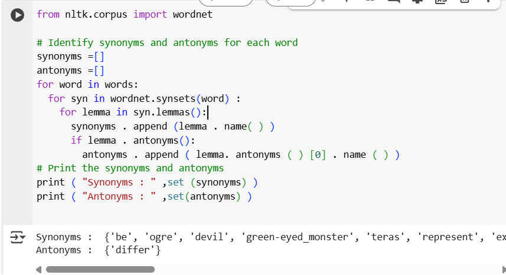

<h1 align =center>Implementation of Semantic Analysis
</h1>
<H3> NAME: MANOJ KUMAR S</H3>
<H3> REGISTER NUMBER: 212223240082</H3>
<H3> EXPERIMENT NO: 06 </H3>
<H3> DATE: 17.5.25</H3>

# Aim:
 to perform Parts of speech identification and Synonym using Natural Language Processing (NLP) techniques. 

# Algorithm:
Step 1: Import the nltk library.<br>
Step 2: Download the 'punkt', 'wordnet', and 'averaged_perceptron_tagger' resources.<br>
Step 3:Accept user input for the text.<br>
Step 4:Tokenize the input text into words using the word_tokenize function.<br>
Step 5:Iterate through each word in the tokenized text.<br>
•	Perform part-of-speech tagging on the tokenized words using nltk.pos_tag.<br>
•	Print each word along with its corresponding part-of-speech tag.<br>
•	For each verb , iterate through its synsets (sets of synonyms) using wordnet.synsets(word).<br>
•	Extract synonyms and antonyms using lemma.name() and lemma.antonyms()[0].name() respectively.<br>
•	Print the unique sets of synonyms and antonyms.

# Program:
```py
import nltk
from nltk.tokenize import word_tokenize

# Download required resources
nltk.download('punkt_tab')  # For tokenization
nltk.download('averaged_perceptron_tagger_eng')  # For POS tagging

# Get input sentence
sentence = input("Enter a sentence: ")

# Tokenize the sentence into words
words = word_tokenize(sentence)

# Identify the parts of speech for each word
pos_tags = nltk.pos_tag(words)

# Print results
print("Words:", words)
print("POS Tags:", pos_tags)

from nltk.corpus import wordnet

# Identify synonyms and antonyms for each word
synonyms =[]
antonyms =[]
for word in words:
	for syn in wordnet.synsets(word) :
		for lemma in syn.lemmas():
			synonyms . append (lemma . name( ) )
			if lemma . antonyms():
				antonyms . append ( lemma. antonyms ( ) [0] . name ( ) )
# Print the synonyms and antonyms
print ( "Synonyms : " ,set (synonyms) )
print ( "Antonyms : " ,set(antonyms) )

```
# Output:



# Result:
Thus ,the program to perform the Parts of Speech identification and Synonymis executed sucessfully.
